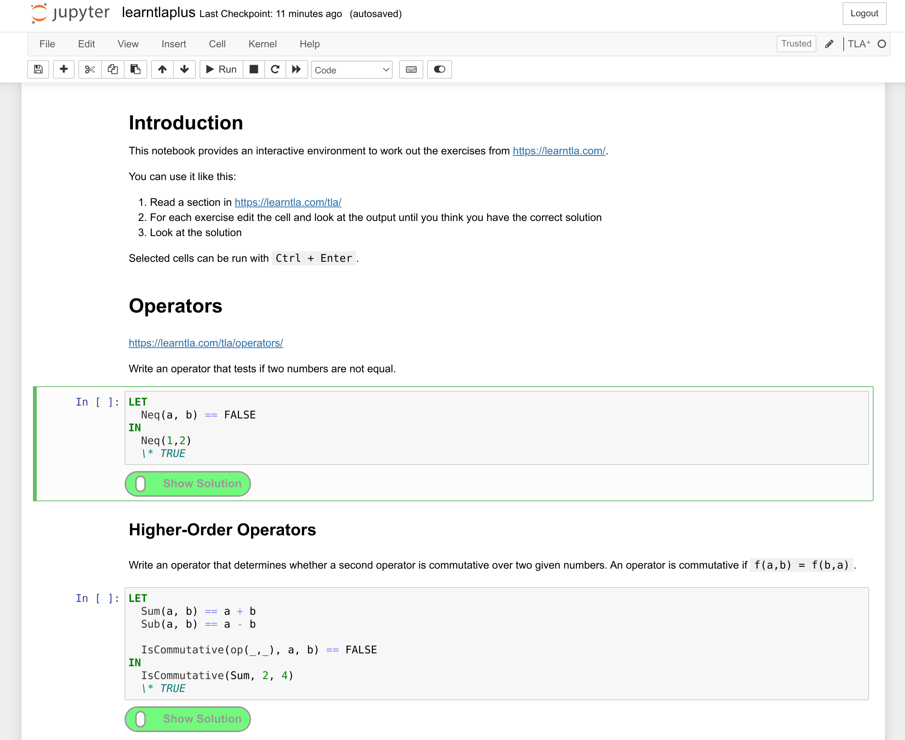

[](https://mybinder.org/v2/gh/Alexander-N/tlaplus-exercises/HEAD?filepath=learntlaplus.ipynb)
# tlaplus-exercises

[tlaplus_jupyter](https://github.com/kelvich/tlaplus_jupyter) notebook with the exercises from [Learn TLA+](https://learntla.com/t).

Can be run in [Binder](https://mybinder.org/v2/gh/Alexander-N/tlaplus-exercises/HEAD?filepath=learntlaplus.ipynb) or locally, either with docker or by running these commands to install tlaplus_jupyter and a notebook extension for hiding the exercise solutions:
```
pip install tlaplus_jupyter jupyter_contrib_nbextensions
jupyter contrib nbextension install --user
jupyter nbextension enable exercise2/main
python -m tlaplus_jupyter.install
```

